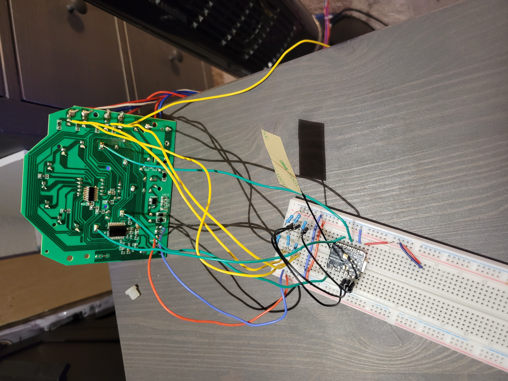
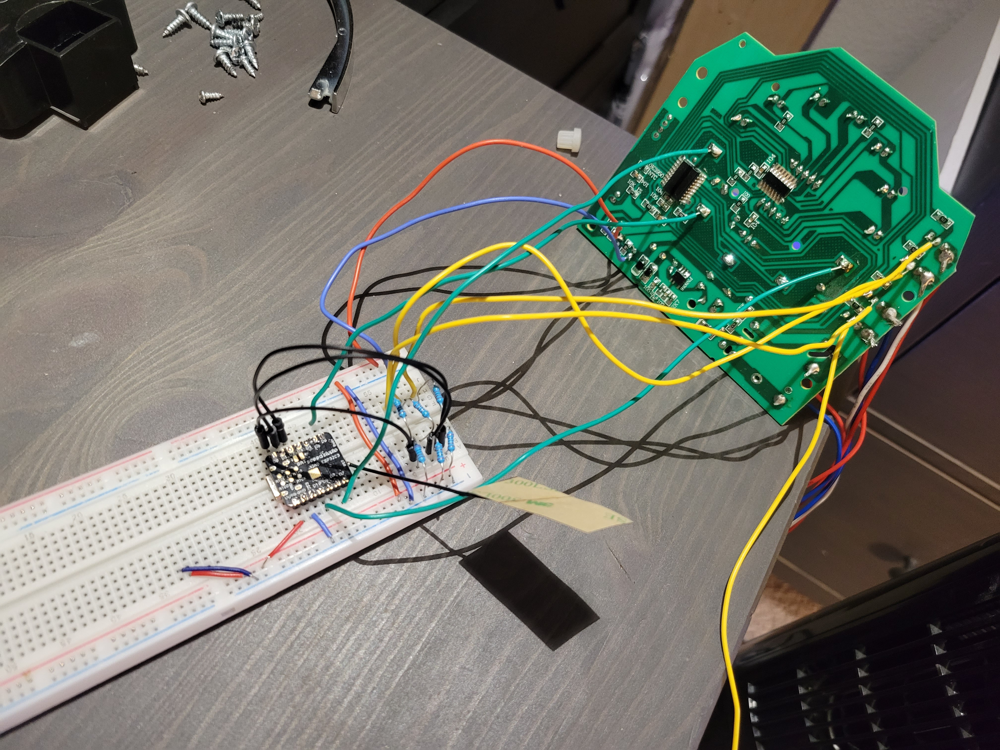
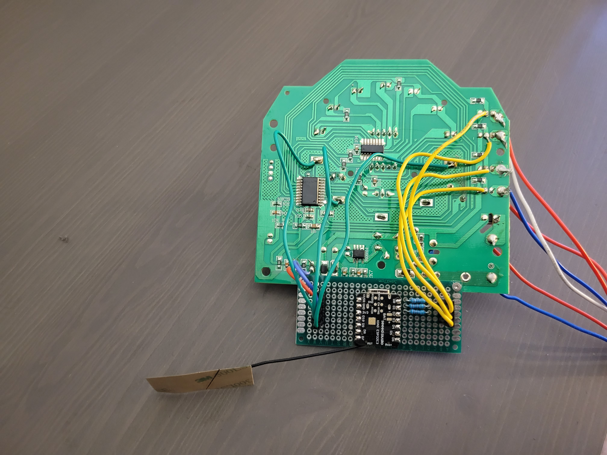
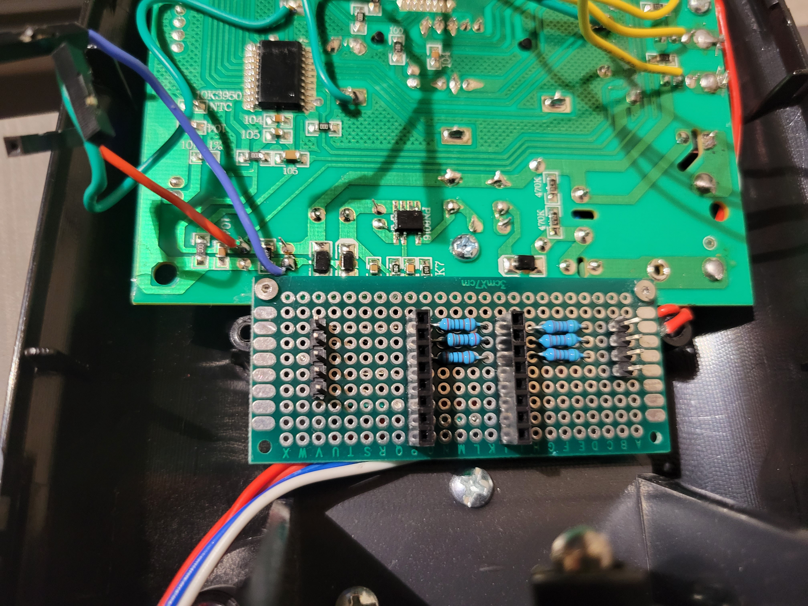
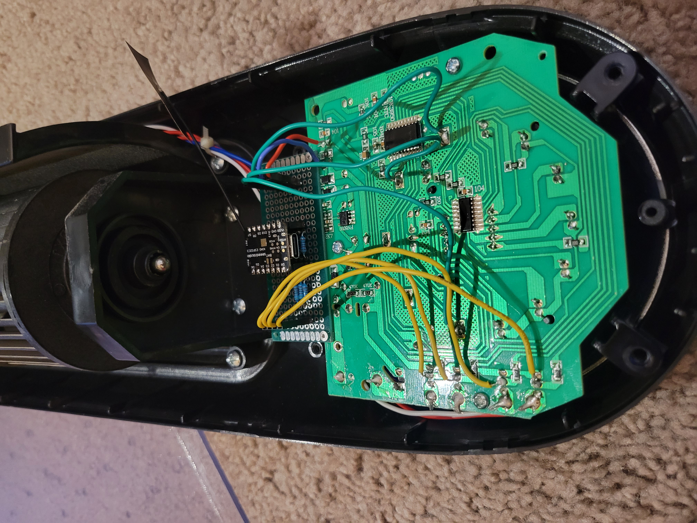
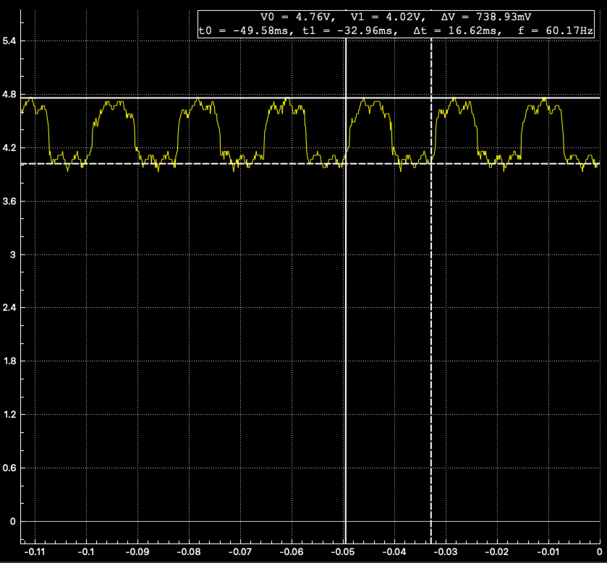
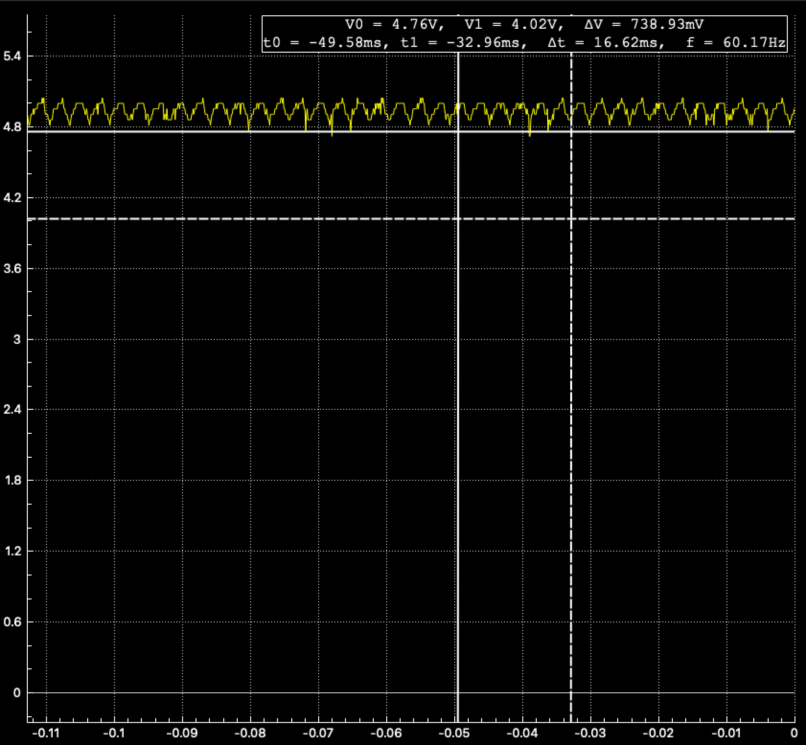
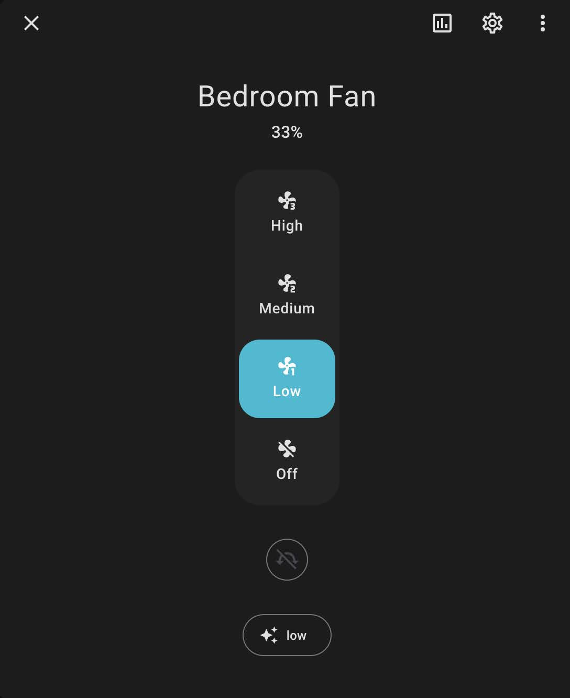

# Smarter Fan

This repository describes retrofitting of a remote-controlled fan
using a wifi-connected microcontroller that is connected to Home
Assistant. Then, the fan can be controlled using a web app,
mobile app or pretty much any other controlling interface.

## Ingredients

| Component Function     | Specific Component | Description |
| ---------------------- | ------------------ | ----------- |
| Fan                    | [Air Choice 48 Inch Tower Fan](https://www.ebay.com/itm/264793227487) | Tower Fan - 48 inch oscillating fan with IR remote |
| Microcontroller   | [Seeed Studio XIAO ESP32C3](https://www.seeedstudio.com/Seeed-XIAO-ESP32C3-p-5431.html) | Small Wi-Fi enabled microcontroller |
| Resistors   | 3 x 2,000 Ω and 3x 5,000 Ω | Different values would also work; specific details should not be that important |

## Hardware Setup

In this section we describe how the hardware is connected in
order to control the fan.

<figure>
  
  
  <figcaption>Breadboard prototypes</figcaption>
</figure>

Firstly, the microcontroller has to be powered. Conveniently, the fan's ICs
also need DC power (5V) and the positive and the negative pins can be easily found
using a multimeter. We are going to use these pins to power the microcontroller.

Secondly, we need to identify the pins that are used to control the fan.
These can be found as they are connected to the push buttons on the user
interface. These buttons act as a capacitive touch sensor buttons and we connect
  - Power button to the pin GPIO 10 (D10)
  - Speed button to the pin GPIO 8 (D8)
  - Swing button to the pin GPIO 21 (D6)

Finally, we need to have a sensor to observe the state of the fan in case
the state is changed manually by pressing the buttons or using the IR controller.
For that, we use the output pins that are connected directly to the motors
leading from the controlling IC. We connect them to analog I/O pins as we need
to measure the exact voltage (see the Software section bellow for details).
As the microcontroller's analog pins can only measure voltages up to 3.3V we
use a pair of 2kΩ and 5kΩ resistors as a 2:7 voltage divider for each pin.
Specifically, we connect
  - Low speed output to the pin GPIO 4 (A2)
  - Medium speed output to the pin GPIO 3 (A1)
  - High speed output to the pin GPIO 2 (A0)

Unfortunately, this microcontroller does not have any more analog I/O pins
that can be used therefore we are not able to observe the state of the
oscillation.

<figure>
  
  
  <figcaption>Final product soldered on a prototype PCB</figcaption>
</figure>

<figure>
  
  <figcaption>It all fits nicely inside of the fan</figcaption>
</figure>

## Software Setup

### ESPHome on the Microcontroller

We are using [ESPHome](https://esphome.io/) to operate the microcontroller.
You can find the entire configuration in [fan-esphome.yaml](./fan-esphome.yaml).

Apart from the basic boilerplate configuration, the file defines the following:

#### State Sensors

Using an oscilloscope, we can see that a typical pattern for an active
pin that drives a motor of the fan has an oscillating shape at 60 Hz
(between 4.0V and 4.7V).
On the other hand, an inactive pin has a pretty much flat (with some noise)
pattern.
<figure>
  
  
  <figcaption>Active and inactive pin voltage patterns</figcaption>
</figure>

To measure the state of the fan, we configured an adc sensor in esphome
to sample the voltage 50 times at 100 Hz and then take 20th percentile.
This way, we expect to measure about
  - Pin active: 1.14V after using the 2:7 voltage divider on 4.0V
  - Pin inactive: 1.34V after using the 2:7 voltage divider on 4.7V 

Finally, we use [Analog Threshold](https://esphome.io/components/binary_sensor/analog_threshold.html)
component to define a binary sensor using a threshold of 1.25V that is
somewhat in between the expected values.

#### Pressing Buttons

To press the buttons using the microcontroller, we define a simple
script with a single parameter that is the pin number. The script
shortly triggers the pin high for 100ms before switching it back
to the digital input mode (high-impedance state). This ensures that
the buttons can still be pressed manually and trigger the fan.
Finally, we run the script every time we want to press the button
and at the very beginning to initialize the state of the pins.

### Home Assistant

The configuration for the Home Assistant is included by adding
the following lines in the main configuration file:

```
homeassistant:
  packages:
    bedroom_fan: !include bedroom_fan.yaml
```

In the configuration we define a couple helper sensors first that
aggregate the output of the raw sensors from the microcontroller:
  - Fan Speed - uses the binary indicators for individual speeds to decided what speed is currently active
  - Fan State - considers the fan on if at least one of the speeds is on

[Fan Template](https://www.home-assistant.io/integrations/fan.template/) is used to represent
the fan. Helper scripts are defined to perform individual functions. Sometimes
the buttons have to be pressed repeatedly until the desired state is reached.
We add a small delay between consecutive button presses to allow for sensors
to observe the changed state.

<figure>
  
  <figcaption>Finally, the fan can be controlled using the Home Assistant UI, or other integrations like Google Assistant, Alexa or HomeKit. The state is also updated if the buttons are manually pressed or controlled by the IR remote.</figcaption>
</figure>

